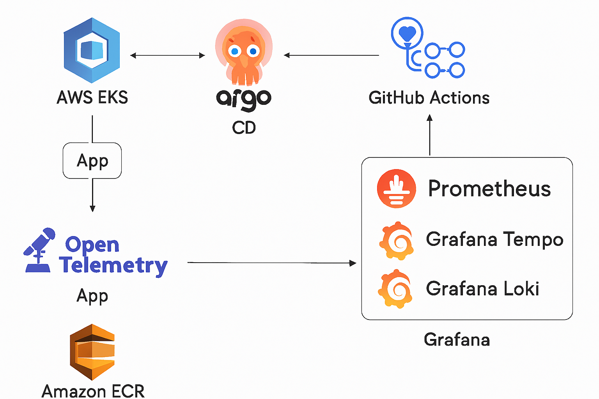

# 🚀 Challenge Project 1





## 📌 Descrição
Este projeto implementa uma aplicação web containerizada e implantada em um cluster **Kubernetes (EKS)** utilizando **GitOps com ArgoCD**, **CI/CD com GitHub Actions** e **observabilidade completa** com **OpenTelemetry**, **Prometheus**, **Grafana Tempo** e **Loki**.

O objetivo é demonstrar práticas modernas de **SRE** (Site Reliability Engineering) e **DevOps**, garantindo **resiliência**, **confiabilidade** e **visibilidade** de ponta a ponta.

---

## 🎯 Objetivos
- Provisionar infraestrutura **EKS** com **Terraform**
- Deploy da aplicação via **Helm Chart**
- Pipeline **CI/CD** para build, push no **ECR** e atualização GitOps
- Estratégia de rollout **canário** com **Argo Rollouts**
- Observabilidade com métricas, traces e logs (Loki, OTEL e Prometheus)
- Dashboards no Grafana para monitoramento  

---

## 🗂 Estrutura do Repositório

```plaintext
app/                        # Código da aplicação e Dockerfile
gitops-repo/
  ├── webapps/
  │   └── challenge-1-web/  # Helm chart da aplicação
  └── observability/        # Manifests de observabilidade
      ├── otel-collector/   # OpenTelemetry Collector
      ├── prometheus/       # Prometheus
      ├── tempo/            # Grafana Tempo
      └── loki/             # Grafana Loki
.github/workflows/          # Pipelines GitHub Actions
terraform/eks/              # Provisionamento do cluster EKS
